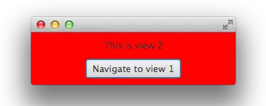

## DataFx8学习笔记二

这一部分,我们来学习下一个流是如何控制视图之间相互导航（跳转）的。 在这个例子中我们在一个流中定义两个视图，控制一个视图导航至另一个视图。

下图显示了两个图的交互过程：

我们先来编写第一个视图文件：

	<?xml version="1.0" encoding="UTF-8"?>
	 
	<?import java.lang.*?>
	<?import java.util.*?>
	<?import javafx.geometry.*?>
	<?import javafx.scene.control.*?>
	<?import javafx.scene.layout.*?>
	<?import javafx.scene.paint.*?>
	 
	<StackPane id="StackPane" maxHeight="-Infinity" maxWidth="-1.0" minHeight="-Infinity" minWidth="-Infinity" prefHeight="-1.0" prefWidth="-1.0" xmlns:fx="http://javafx.com/fxml/1" xmlns="http://javafx.com/javafx/2.2">
	    <children>
	        <VBox alignment="CENTER" prefHeight="-1.0" prefWidth="300.0" spacing="12.0">
	            <children>
	                <Label fx:id="resultLabel" text="This is view 1" />
	                <Button fx:id="actionButton" mnemonicParsing="false" text="Navigate to view 2" />
	            </children>
	            <padding>
	                <Insets bottom="12.0" left="12.0" right="12.0" top="12.0" />
	            </padding>
	        </VBox>
	    </children>
	    <padding>
	        <Insets />
	    </padding>
	</StackPane>

效果图如下：

下面是视图二的fxml文件内容：

	<?xml version="1.0" encoding="UTF-8"?>
	 
	<?import java.lang.*?>
	<?import java.util.*?>
	<?import javafx.geometry.*?>
	<?import javafx.scene.control.*?>
	<?import javafx.scene.layout.*?>
	<?import javafx.scene.paint.*?>
	 
	<StackPane id="StackPane" maxHeight="-Infinity" maxWidth="-1.0" minHeight="-Infinity" minWidth="-Infinity" prefHeight="-1.0" prefWidth="-1.0" xmlns:fx="http://javafx.com/fxml/1" xmlns="http://javafx.com/javafx/2.2">
	  <children>
	    <VBox alignment="CENTER" prefHeight="-1.0" prefWidth="300.0" spacing="12.0" style="-fx-background-color: red;">
	      <children>
	        <Label fx:id="resultLabel" text="This is view 2" />
	        <Button fx:id="actionButton" mnemonicParsing="false" text="Navigate to view 1" />
	      </children>
	      <padding>
	        <Insets bottom="12.0" left="12.0" right="12.0" top="12.0" />
	      </padding>
	    </VBox>
	  </children>
	  <padding>
	    <Insets />
	  </padding>
	</StackPane>

效果如如下：

接下来，我们为两个视图分别创建控制器类，第一步我们创建一个带有 `@FXMLController`Z注解的空的类，分别定义一个按钮（名称对应于 fxml 文件中的 fx:id）

	@FXMLController("view2.fxml")
	public class View2Controller {
	 
	    @FXML
	    private Button actionButton;
	}

	@FXMLController("view2.fxml")
	public class View2Controller {
	 
	    @FXML
	    private Button actionButton;
	}

这些都准备好之后，一个基于流的应用程序就可以创建了。正如我们前面学习笔记中提到过的，只有一个流的应用程序是很容易创建的，我们这里采用同样的方式，下面是入口类：

public class Tutorial2Main extends Application {
 
    public static void main(String[] args) {
        launch(args);
    }
 
    @Override
    public void start(Stage primaryStage) throws Exception {
        new Flow(View1Controller.class).startInStage(primaryStage);
    }
}

一个新的流就创建成功了，视图一为他的启动视图。你现在启动项目，已经可以看到第一个视图，但是当你点击按钮时并不会有任何反馈。为了添加一个动作连接到第二个视图，`DataFx` 提供了一个特殊的注解 `@LinkAction` . 这个注解的工作原理有点像我们笔记一中提到过的 `@ActionTrigger` .按钮一旦被点击，动作事件就会被触发，并交给 `DataFx` 容器处理。使用 `@LinkAction` 时，必须指定目标视图的控制器，如下所示：

	@FXMLController("view1.fxml")
	public class View1Controller {
	 
	    @FXML
	    @LinkAction(View2Controller.class)
	    private Button actionButton;
	}

不管你什么时候点击这个按钮，流都会将你导航至指定的控制器相对应的视图中， `@LinkAction` 可以添加到任意的 JavaFx 节点上。如果这个组件继承了 `ButtonBase` 类或者  `MenuItem  `类 ,控制器会添加一个动作事件处理器。否则，这个动作需要在鼠标点击后才会触发。通过这个注解，开发者不用处理繁琐的视图导航，比如改变视图，创建新的数据模型等。 DataFX将自动处理所有这些步骤，一旦触发操作，定义的视图将出现在屏幕上。

你应该也能猜到如何从视图二导航回视图一了：

	@FXMLController("view2.fxml")
	public class View2Controller {
	 
	    @FXML
	    @LinkAction(View1Controller.class)
	    private Button actionButton;
	}

完成以上这些，你就已经掌握了如何创建一个简单的流了

我们在前面提到过， 任何一个动作都需要通过唯一的ID来定义 ， 在使用 `@LinkAction` 注解的情况下，开发者不需要自己定义这些 ID ,`DataFx` 会在控制器将要初始化的时候自动创建。这样代码会显得更简洁清晰。在后面的笔记中 ， 我们会学习到几种方式来定义流中的导航。